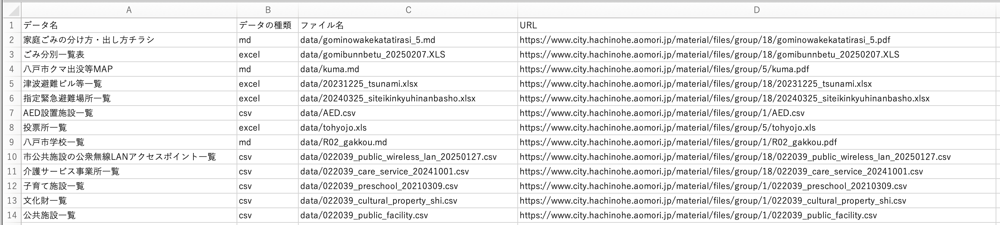

# 生成AIで「×(カケ)る」八戸オープンデータ


## 使用したもの
* [Streamlit](https://streamlit.io/)
* [Ollama](https://ollama.com/)
* https://huggingface.co/rinna/deepseek-r1-distill-qwen2.5-bakeneko-32b-gguf
* [八戸市オープンデータ](https://www.city.hachinohe.aomori.jp/gyoseijoho/tokeijoho/opendata/)

## インストール
```
git clone https://github.com/akokubo/ai_co_create_open_data_hachinohe.git
cd ai_co_create_open_data_hachinohe
python -m venv venv
source venv/bin/activate
pip install --upgrade pip
pip install openpyxl pandas ollama streamlit
mkdir data
```
※仮想環境は、condaなどでもいい。

## データの取得
1. [八戸市オープンデータコーナー](https://www.city.hachinohe.aomori.jp/soshikikarasagasu/johosystemka/tokeijoho/1/1495.html)からデータをダウンロードし、dataフォルダに置く。
2. PDFは[MarkItDown](https://github.com/microsoft/markitdown)でMarkdownに変換(拡張子md)。
3. データ名、データの種類(csv、excel、md)、ファイル名(data/からはじまる)、URL(実際には使用しない)からなるdata/opendata.xlsxを作る


## Ollamaの準備
1. Ollamaを[ダウンロード](https://ollama.com/download/windows)してインストール
2. Ollamaで大規模言語モデルのrinna/deepseek-r1-distill-qwen2.5-bakeneko-32b-gguf:latestをpullする。
```
ollama pull hf.co/rinna/deepseek-r1-distill-qwen2.5-bakeneko-32b-gguf:latest
```
※ PCのスペックに合わせて大規模言語モデルは選ぶ必要がある。小さいモデルには、たとえば lucas2024/gemma-2-2b-jpn-it などがある。別のモデルを使うときは、app.pyの96行目を書き換える。

## 実行
```
streamlit run app.py
```

## 作者
[小久保 温(こくぼ・あつし)](https://akokubo.github.io/)
